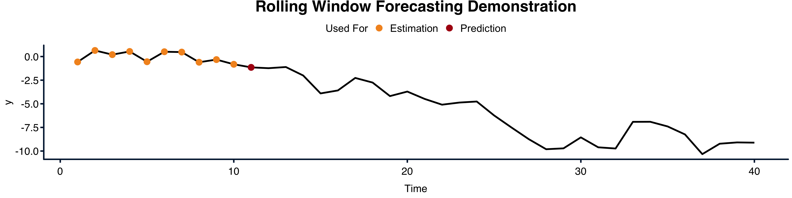

```{r setup, include=FALSE}
knitr::opts_chunk$set(echo = FALSE, 
                      dev = "tiff")

#renderPlot <- function(expr) shiny::renderPlot(expr, width = 2000, height = 500)

#rm(list = ls())
if(!require(vars)) install.packages("vars"); require(vars);
if(!require(shiny)) install.packages("shiny"); require(shiny);
if(!require(sortable)) install.packages("sortable"); require(sortable);
if(!require(tidyverse)) install.packages("tidyverse"); require(tidyverse);
if(!require(igraph)) install.packages("igraph"); require(igraph);
if(!require(bootUR)) install.packages("bootUR"); require(bootUR);
# if(!require(gifski)) install.packages("gifski"); require(gifski);
# if(!require(transformr)) install.packages("transformr"); require(transformr);
# if(!require(svglite)) install.packages("svglite"); require(svglite);
# if(!require(gganimate)) install.packages("gganimate"); require(gganimate);
source("helpers.R")
# Setting up everything that is statitic
# Simulating a VAR
set.seed(6150533)
N.true <- 3
periods.true <- 200
p.true <- 2
scale_factor <- 100 # Only to make things look better

coef_mat.true <- create_rand_coef_mat(N = N.true, p = p.true, max_eigval = 0.99,
                                      min = 0, max = 1)
data <- sim_VAR(periods = periods.true, N = N.true, coef_mat = coef_mat.true,
                sd = 0.01, burnin = 1000, init_y = rep(10, N.true*p.true))
data <- data*scale_factor
# 
# mod <- vars::VAR(data, p = p.true, type = "none")
```

# Introduction

In this notebook we will dive into **Vector AutoRegressive (VAR)** models. VAR models are often used in time series as an extension to AutoRegressive (AR) models. While AR models only model one time series at a time, VAR models model multiple series at a time. This allows VAR models to make forecasts for longer horizons without having to assume that some variables are *exogenous*. We will investigate this characteristic and many of the other features of VAR models in this notebook. However, before we get started, we need to set a *seed*. The seed allows us all to obtain the same results. Please fill in a seed below. You can also already observe how some of the graphs start changing. This might take a few seconds, so please be patient.


```{r, context="server"}
using.seed <- 6150533
data <- NULL

sim_data <- reactive({
  set.seed(input$seed)
  coef_mat.true <- create_rand_coef_mat(N = N.true, p = p.true, max_eigval = 0.8, 
                                      min = 0, max = 1)
  data <- sim_VAR(periods = periods.true, N = N.true, coef_mat = coef_mat.true,
                sd = 0.01, burnin = 1000, init_y = rep(0, N.true*p.true))
  data <- data*scale_factor
  colnames(data) <- paste0(sample(LETTERS, 1), 1:ncol(data))
  data <- as.data.frame(data)
  
  list(data = data,
       seed = input$seed,
       coef_mat = coef_mat.true)
})

get_data <- reactive({
  if(!is.null(input$use_user_data)){
    if(input$use_user_data){
      return(get_user_data_selected())
    }
  }
  l <- sim_data()
  l$data
})
```


::: {.control-full-size}
```{r}
numericInput(
  "seed",
  "Set a seed (any Integer):",
  6150533,
  min = 100,
  max = 1e10,
  step = NA,
  width = "auto"
)
```

:::

Using the seed above, we created a random data-set. Our data-set contains three variables. This might for example be investments, consumption, and GDP in an economic context. It could also be the price of three assets. The basic idea behind VAR models is that these series might be related to each other's past. In the macro context, GDP might not just depend on past GDP, but also on past investments and consumption. In the asset context, the price for one asset might not just depend on the past price of that asset but also on the past price of the other assets. VARs allow us to model this interdependency in a more inclusive way than AR models do. 


In an AR model we would only be able to model one of the series and would have to assume that the others are exogenously given. This means, that we just, for some reason or another, have information on the other variables. VARs on the other hand model all variables at the same time. We therefore do not need to assume that any of the variables are exogenously given. This allows us to make longer horizon forecasts but also to investigate what an unexpected shock in one variable does to the others.


:::{.info}

Mathematically, a VAR($p$) is written in the form of 

$$
y_t = \Phi_1 y_{t-1} + ... + \Phi_p y_{t-p} + \varepsilon_t
$$

where $y_t$ is a $N\times 1$ vector of the variables that are being modelled, $\Phi_i$ is a $N\times N$ matrix of coefficients, linking the $i^{th}$ lag of each variable to each other. $\varepsilon_t$ is often assumed to be white noise.

In the economic context where we model GDP, consumption, and investments together, and assume that we have a *memory* of two periods, hence a VAR(2) model, the above can be written as

$$
\left[\begin{array}[l] \text{GDP}_t \\ \text{CONS}_t \\ \text{INV}_t \end{array}\right] = 
\Phi_1 \left[\begin{array}[l] \text{GDP}_{t-1} \\ \text{CONS}_{t-1} \\ \text{INV}_{t-1} \end{array}\right] + 
\Phi_2 \left[\begin{array}[l] \text{GDP}_{t-2} \\ \text{CONS}_{t-2} \\ \text{INV}_{t-2} \end{array}\right] + \varepsilon_t
$$
This is equivalent to saying that GDP today can be modelled as depending on GDP in the last period, but also two periods ago. Moreover, GDP in this period also depends on consumption and investment in the last two periods. Similarly for consumption and investments. This kind of behaviour is often present in economics and business, since processes are often sluggish and need time to adjust to changes. For example, investments might lag behind GDP, because it takes time for businesses to make investment decisions. Thus, even if GDP and hence in a simple world the income of firms increases in this period, investments might not increase in the same period, because management first needs to make a decision on what to invest in, and this might take one, two, or even more periods.

The problem with the above representation of a VAR($p$) model is, that it quickly becomes messy and difficult to analyse. For example, written in the general form, it is difficult to say whether a VAR($p$) model is *stable* and *stationary*. We will come back to what these two mean.

In order to analyse the stability and stationarity of VAR($p$) models, they are often written in what is called the *companion form*. The companion form is essentially just a stacked version of a VAR($p$) model, stacked in such a way that it can be written as a VAR(1) model. For the GDP, consumption, and investments example, this looks like the following

$$
\left[\begin{array} \text{GDP}_t \\ \text{CONS}_t \\ \text{INV}_t \\ 
\text{GDP}_{t-1} \\ \text{CONS}_{t-1} \\ \text{INV}_{t-1}\end{array}\right] = 
\left[\begin{array}; \Phi_1 & \Phi_2 \\ I_{3\times 3} & O_{3\times 3}\end{array}\right]
\left[\begin{array} \text{GDP}_{t-1} \\ \text{CONS}_{t-1} \\ \text{INV}_{t-1} \\ 
\text{GDP}_{t-2} \\ \text{CONS}_{t-2} \\ \text{INV}_{t-2}\end{array}\right] + 
\left[\begin{array}; \varepsilon_t \\ 0 \end{array}\right]
$$
Thus, our VAR($p$) model for the real economy can also be written in a VAR(1) form by using the companion form. We can generalise it, and write every VAR($p$) model in the form

$$
\underbrace{\left[\begin{array}; y_t \\ y_{t-1} \\ \vdots \\ y_{t-p+2} \\ y_{t-p+1}\end{array}\right]}_{\xi_t} = 
\underbrace{\left[\begin{array}; \Phi_1 & \Phi_2 & \dots & \Phi_{p-1} & \Phi_p  \\
I_{N\times N} & O_{N\times N} & \dots & O_{N\times N} & O_{N\times N} \\
O_{N\times N} & I_{N\times N} & \dots & O_{N\times N} & O_{N\times N} \\
\vdots & \vdots & \ddots & \vdots & \vdots \\
O_{N\times N} & O_{N\times N} & \dots & I_{N\times N} & O_{N\times N}\end{array}\right]}_{F}
\underbrace{\left[\begin{array}; y_{t-1} \\ y_{t-2} \\ \vdots \\ y_{t-p+1} \\ y_{t-p}\end{array}\right]}_{\xi_{t-1}} +
\underbrace{\left[\begin{array}; \varepsilon_t \\ 0 \\ \vdots \\ 0 \\ 0\end{array}\right]}_{\nu_t}
$$

We can use this companion form to investigate the stability of a VAR. A VAR($p$) is stable, if all eigenvalues of $F$ are in absolute value less than one. Stability means, that a small change in one variable, e.g. through a shock, does not lead to an explosive process in which the model suddenly shoots off to infinity. If a VAR($p$) is stable, and the error term, $\varepsilon_t$ is stationary, then the VAR($p$) is stationary. Stationarity is explained later in the notebook.

The simulated data in this notebook comes from a stable and stationary VAR(2) model, where $F$ is given below (Note: we rounded the coefficients to three decimals). If you want to check whether you understood the mathematical description, one nice exercise is to try to figure out what the relationship of the second variable in the simulated data set and the first variable is, e.g. if the second variable increases by one in this period, and everything else is the same, what happens in the next two periods to the first variable?


```{r}
renderPrint({
  sd <- sim_data()
  nam <- colnames(sd$data)
  F_mat <- sd$coef_mat
  colnames(F_mat) <- paste0(nam, ".L", rep(1:2, each = 3))
  rownames(F_mat) <- c(nam, nam)
  rownames(F_mat)[4:6] <- paste0(nam, ".L1")
  print(round(F_mat, 3))
})
```


**Answer:**
Answering what happens next period is certainly easier than answering what happens in two periods. For next period we have the direct relationship given by 

$$
y_{1, t} = \Phi_{1, 1}y_{1, t-1} + \Phi_{1, 2}y_{2, t-1} + \Phi_{1, 3}y_{3, t-1} +
\Phi_{2, 1}y_{1, t-2} + \Phi_{2, 2}y_{2, t-2} + \Phi_{2, 3}y_{3, t-2}
$$

Ans thus, if $y_{2, t-1}$ increased by one unit, then $y_{1, t}$ will increase by $\Phi_{1, 2}$ units, which in this example is equal to `r reactive({round(sim_data()$coef_mat[1, 2], 3)})`. 

We cannot use the same strategy as above to answer what happens in period two. Reason for this is that the change will already introduce changes in all variables one period from today, and hence we need to take into account all these intermediate changes to fully understand what the effect of a one unit increase in the second variable is. The easiest way to do so is to come back to the companion form. The companion form was given by 

$$
\xi_{t} = F\xi_{t-1} + \nu_{t}
$$

By substituting the meaning of $\xi_{t-1}$ into the equation above, we arrive at

$$
\xi_{t} = FF\xi_{t-2} + F\nu_{t-1} + \nu_{t}
$$

This now allows us to answer the second part of the question above, since we now have a relationship between period $t$ variables and period $t-2$ or earlier variables. Thus, all intermediate effects are accounted for in the new coefficient matrix $FF = F^2$. We can now check what the effect of a one unit increase in the second variable is by checking the value in the first row, second column of the matrix $F^2$. The matrix $FF=F^2$ is given below (rounded to three decimals).

```{r}
renderPrint({
  sd <- sim_data()
  nam <- colnames(sd$data)
  F_mat <- sd$coef_mat
  colnames(F_mat) <- paste0(nam, ".L", rep(2:3, each = 3))
  rownames(F_mat) <- c(nam, nam)
  rownames(F_mat)[4:6] <- paste0(nam, ".L1")
  print(round(F_mat%*%F_mat, 3))
})
```


:::

Below is a time series plot of the three series simulated. This will depend on the seed you set. Play around with the seed and see how the data changes. 

::: {.control-full-size}
```{r, echo = FALSE}
renderUI({
  varSelectInput("selected_vars",
               "Variables to show:",
               get_data(),
               selected = colnames(get_data()),
               multiple = TRUE,
               width = "auto")
})
```
:::

```{r, echo = FALSE, class.output = "full-page"}
renderPlot({
  data <- get_data()
  # selected_vars <- input$selected_vars
  # if(is.null(selected_vars) | length(selected_vars)==0){
  #   selected_vars <- colnames(data)
  # }
  validate(
    need(length(input$selected_vars) != 0, "Please select at least one variable")
  )
  # if (length(input$selected_vars) == 0) stop("Please select at least one variable.")
  as_tibble(data) %>%
    dplyr::select_at(.vars = vars(as.character(input$selected_vars))) %>%
    dplyr::mutate(Time = 1:nrow(data)) %>%
    tidyr::pivot_longer(-Time, names_to = "Variable", values_to = "Val") %>%
    ggplot2::ggplot() +
    ggplot2::geom_line(aes(Time, Val, color = Variable)) +
    xlab("Time") + ylab("") +
    theme_SnT() +
    scale_color_um()
  }, height = 500
)
```

# Estimation

Note that all the series in the above plot are, what we call, stationary. In simple words, stationarity means that the mean/expected value of the series does not change over time. If our data had a clear time trend for example, then the data would not be stationary, because we would expect a different value next week than we do for this week. If your data shows any trends, then you first need to transform your data to stationarity. Once the data is stationary then you can estimate a VAR model.

::: {.info}

We actually distinguish between strict (strong) stationarity and weak (second-order) stationarity. Strict stationarity means that the distribution does not change over time. For example, if you take the points $(y_t, y_{t-1})$ then these are always distributed like the points $(y_{t-h}, y_{t-1-h})$ no matter what $h$ is. This actually also holds for any length of points.

Since strict stationarity is a rather strong condition and is difficult to verify in practice, we often work with weak stationarity. In this notebook, if we speak of stationarity, then we mean weak stationarity. Weak stationarity actually implies more than what is written in the main text. The three conditions for weak stationarity are

1. The mean must be the same for all time periods: $\mathbb{E}[y_t]=\mu$ for all $t$
2. The second moment must be the same for all time periods: $\mathbb{E}[y_t^2]=\mu$ for all $t$. Together with condition one, this actually implies that the variance is the same for all time periods $t$
3. The autocovariance can only depend on the time gap between the two observations. E.g. $Cov(y_t, y_{t-h})=Cov(y_{t+k}, y_{t-h+k})$ since both are $h$ time periods apart

:::

VAR models are often also written as **VAR($p$)** to emphasise that they depend on a parameter, namely the lag or order $p$. This parameter, in rough terms, can be thought of as a tuning parameter. It determines the maximum lag included in the model. For example, if $p=2$, then we allow for two lags in our model. If $p=4$ and we have quarterly data, then we basically allow for lags up until a year ago. 

Because VAR models have this dependency on $p$, choosing the right $p$ can be quite crucial. You can play around in the graph below to see what the choice of $p$ does to the estimate (Note: we always loose the first $p$ observations of our data when estimating the VAR. Thus, if $p$ is very large, then we only have very few actual observations to estimate the model).

::: {.control-full-size}
```{r}
sliderInput("vars_p", 
            label = "Maximum lag length:",
            min = 1,
            max = min(30, periods.true-1),
            value = 3, 
            step = 1,
            ticks = FALSE,
            width = "auto")

renderUI({
  varSelectInput("vars_display_variable",
               label = "Variable to Show:",
               data = get_data(),
               width = "auto")
})
```
:::

```{r}
renderPlot({
  data <- get_data()
  mod <- vars::VAR(data, p = input$vars_p, type = "none")
  R2 <- round(summary(mod$varresult[[as.character(input$vars_display_variable)]])$r.squared, 2)
  adj.R2 <- round(summary(mod$varresult[[as.character(input$vars_display_variable)]])$adj.r.squared, 2)
  Performance <- paste("R2:", R2, "     adj. R2:", adj.R2)
  fitted <- fitted(mod)
  df <- data
  colnames(df) <- paste0(colnames(df), "_observed")
  padding <- matrix(nrow = nrow(df) - nrow(fitted), ncol = ncol(fitted))
  fitted <- rbind(padding, fitted)
  colnames(fitted) <- paste0(colnames(fitted), "_fitted")
  df <- cbind(df, fitted)
  p <- as_tibble(df) %>%
    mutate(Time = 1:n()) %>%
    pivot_longer(-Time,
                 names_to = c("Variable", "TS"),
                 names_sep = "_") %>%
    mutate(TS = factor(TS, levels = c("observed", "fitted"))) %>%
    filter(Variable == as.character(input$vars_display_variable)) %>%
    ggplot() +
    geom_line(aes(Time, value, color = TS)) +
    geom_point(aes(x = 0, y =0, fill = Performance), alpha = 0) +
    xlab("") + ylab("") +
    theme_SnT() +
    scale_color_um(palette = "main") +
    guides(color = guide_legend(order = 1),
           fill = guide_legend(order = 2))
  p
}, height = 500)
```

If you played around with the graph above, then you probably noticed that for small changes of $p$, the estimate does not seem to change much. However, if you increase $p$ a lot, then the estimate fits the observed series better and better. In the limiting case one can always increase $p$ so much that the fitted series fits the observed series perfectly. It is rather unlikely though that a model that perfectly fits in sample (on the data observed) does also forecast future values well. It is therefore important to choose the right $p$. Visual inspection is usually misleading, which is why several techniques have been developed to choose the right $p$, among which **Information Criteria** are the most popular. Information criteria find a trade-off between fit and which $p$ was chosen. They penalise high choices of $p$ and therefore prevent over-fitting. They also come with many more favourable characteristics. See the info box if you are interested. In this notebook we will focus on information criteria, and will leave other methods to future discussions.

::: {.info}

Information criteria take the general form

$$
IC(m) = \underbrace{-\frac{2}{T}\log L(m)}_{\text{Lack of Fit}} + \underbrace{\frac{c_T}{T}\dim(m)}_{\text{Complexity Penalty}}
$$
where $m$ represents a model, $T$ is the number of time periods, $\dim(m)$ is the dimension of the parameter space of model $m$, and $c_T$ characterises the different information criteria.

Popular Choices of $c_T$ are

1. $c_T = 2$ which gives the Akaike Information Criterion (AIC)
2. $c_T = \log(T)$ which gives the Bayesian Information Criterion (BIC)
3. $c_T = 2\log\log T$ which gives the Hannan-Quinn Information Criterion (HQ)

One problem in statistics is that an information criterion cannot be optimal for two favourable characteristics: *Efficiency* and *Consistency*. An IC is efficient, if it results in a model with the smallest expected forecasting error, an example of which is AIC. An IC is consistent, if the IC selects the true model with probability going to one. E.g. with a lot of data, the IC will select the right model. Examples of ICs that are consistent are BIC and HQ.

:::

In this notebook we will only use information criteria but will touch upon time series cross validation based upon rolling window estimation, which could also be used as a selection procedure. Below is a standard output that `R` gives you. It shows the *Akaike Information Criterion (AIC)*, the *Hannan-Quinn Information Criterion (HQ)*, the *Schwarz Criterion (SC)* sometimes also referred to as the *Bayesian Information Criterion (BIC)* and the *Final Prediction Error (FPE)*. The first three are the most commonly used. One selects the $p$ (lag length) that results in the smallest information criterion. 


```{r}
renderPrint({
  data <- get_data()
  vars::VARselect(data, type = "none", lag.max = 5)
})
```


Sometimes information criteria can disagree. If this happens, then one can either do cross validation after all, or decide to follow one of the information criteria. In the latter case, it is often helpful to refer to the different characteristics of the information criteria, and it is always good practice to see how sensitive forecasts and other findings are to changing $p$, e.g. to see what happens if one were to follow another information criterion.

::: {.info}

Once one has selected a lag length, $p$, the VAR($p$) model can be estimated. One very useful result is that each equation can be estimated separately by OLS. For example, if we determined a lag length of two for our economic example, then we could estimate the GDP equation just by running the following OLS regression

$$
\begin{array}{ll}
\text{GDP}_t =& \Phi_{1, GDP} \text{GDP}_{t-1} + \Phi_{1, CONS}\text{CONS}_{t-1} + \Phi_{1, INV}\text{INV}_{t-1} + \\
& \Phi_{2, GDP}\text{GDP}_{t-2} + \Phi_{2, CONS}\text{CONS}_{t-2} + \Phi_{2, INV}\text{INV}_{t-3} + \varepsilon_{\text{GDP}, t}
\end{array}
$$

:::

When estimating VAR($p$) models, we often assume that the error $\varepsilon_t$ is white noise, which means that the errors are uncorrelated across time but instantaneous/contemporaneous correlations among errors of the different equations is allowed. We can check this assumption to a certain extent visually by investigating the auto-correlation functions (ACF) and cross correlations of the residuals of our model. This is done in the figure below. 

Since ACF plots show us the correlation of the residuals, for example for GDP, in this period with residuals of the same series $h$ periods ago, we would like to see that none of the bars in the ACF plots lie outside the chosen confidence interval (except the one at zero, which is always one). This is, because white noise errors do not have any significant auto-correlations.

Very similar to the ACF plots, the cross-correlation plots show us the correlation *FROM* one residual series, e.g. residuals for GDP, $h$ periods ago, with another series of residuals, e.g. residuals for consumption, in this period. Since our errors are assumed to be white noise, and since white noise errors are independent of each other, we would like to see that none of these bars lie outside the chosen confidence band (except the first one, which again is allowed to be significantly different from zero).

You can play around below and investigate whether the assumptions are likely to hold. Note though, that the given confidence intervals are only confidence intervals for whether the auto-correlation/cross-correlation at lag $h$ is different from zero. Thus, they are, what we call, point wise confidence intervals. Tests exist that check multiple lags at once, one famous one is the *Ljung-Box* test. 


```{r}
# directly taken from stats::acf implementation
calc_acf_ci <- function(acf_info, ci){
  qnorm((1 + ci)/2)/sqrt(acf_info$n.used)
}

renderPlot({
  data <- get_data()

  from <- as.character(input$from.acf)
  from.index <- which(colnames(data) == from)
  to <- as.character(input$to.acf)
  to.index <- which(colnames(data) == to)
  
  max_lag <- 20
  
  mod <- vars::VAR(data, p = input$vars_p, type = "none")
  resids <- resid(mod)
  acf_info <- acf(resids, plot = FALSE, lag.max = max_lag)
  acf_mat <- acf_info$acf
  # acf_info$lag
  # dim(acf_mat)
  ci_99 <- calc_acf_ci(acf_info, 0.99)
  ci_95 <- calc_acf_ci(acf_info, 0.95)
  ci_80 <- calc_acf_ci(acf_info, 0.8)
  ci_60 <- calc_acf_ci(acf_info, 0.6)
  
  acf_from_to <- acf_mat[,to.index,from.index]
  df <- cbind(0:max_lag, acf_from_to)
  colnames(df) <- c("Lag", "ACF")
  df <- cbind(df, ci_99, ci_95, ci_80, ci_60)


  if (from == to){
    title <- paste("Residual Autocorrelation of", from)
  }else{
    title <- paste("Residual Crosscorrelation from", from, "to", to)
  }

  as_tibble(df) %>%
    pivot_longer(-c(Lag, ACF),
                 names_to = c(".value", "CL"),
                 names_sep = "_") %>%
    mutate(CL = factor(CL, levels = sort(unique(CL), decreasing = TRUE))) %>%
    ggplot() +
    geom_ribbon(aes(x = Lag, ymin = -ci, ymax = ci, alpha = CL),
                fill = um_cols("light-blue")) +
    geom_linerange(aes(Lag, ymin = 0, ymax = ACF), size = 1) +
    geom_hline(yintercept = 0, color = um_cols("dark-blue")) +
    labs(title = title, 
         subtitle = paste0("Estimated Model: VAR(", input$vars_p, ")")) +
    theme_SnT()
})


```

:::{.control-full-size}

```{r}
renderUI({
  data <- get_data()
  shiny::varSelectInput("from.acf", label = "From        ", data = data, 
                      selected = colnames(data)[[1]], width = "auto")
})
renderUI({
  data <- get_data()
  shiny::varSelectInput("to.acf", label = "To          ", data = data, 
                      selected = colnames(data)[[1]], width = "auto")
})
```

:::

# Forecasting

VAR models can easily be used for forecasting. Two main strategies exist. The first and most often used one is recursive forecasting. The second and less frequent used one is direct forecasting. 

Recursive forecasting first uses the last $p$ observations in the data set to forecast the next observation. Then the last $p-1$ observations in the data set and the just forecasted observation are being used to forecast two periods ahead. This is repeated over and over again until the desired forecast horizon is reached. Direct forecasting, on the other hand, uses only observations in the data set to forecast. So for a given forecast horizon $h>1$, the direct forecast approach re-estimates the multivariate model with $y_{t+h-1}$ as dependent variable instead of $y_t$.

Note that recursive forecasting is only possible because we model all series at once. If we instead would use an AR model and would consider two of the three series as exogenous (corresponding to an AutoRegressive Distributed Lag (ARDL) model), then we could not use recursive forecasting, because we would not know the future observations of the exogenous variables. This is a clear advantage of VAR models over AR models. 

You can play around with VAR forecasts in the graph below. Change for example $p$, and see what you observe. What happens when you increase the horizon to a very large number? How do direct forecasts and recursive forecasts compare?

```{r}
forecast_var <- function(data, mod, n.ahead, p, ci, latest, variable){
  reactive({
    forecast <- predict(mod, n.ahead = n.ahead, ci = ci)
    pred <- forecast$fcst[[variable]]
    pred <- pred[, -4, drop = FALSE]
    padding <- nrow(data) - nrow(pred)
    pred <- rbind(matrix(nrow = padding, ncol = 3), pred)
    colnames(pred) <- paste0(colnames(pred), "_CI", floor(100*ci))
    pred
  })
}


direct_forecast_onestep <- function(n.ahead, data, variable, p){
  data <- as.matrix(data)
  lag_mat <- NULL
  if (p > 1) lag_mat <- lag_matrix(data, lags = 1:(p-1))
  y <- dplyr::lead(data[, variable], n.ahead)
  datamat <- cbind(y, data, lag_mat)
  mod <- lm(y ~ -1 + ., data = as.data.frame(datamat))
  pred <- predict(mod, 
                  newdata = as.data.frame(datamat[dim(datamat)[[1]], -1, 
                                                  drop = FALSE]))
  pred
}

direct_forecast_multistep <- function(data, variable, n.ahead = 1:10, 
                                      p = 2, padding_length = 0){
  tmp <- lapply(n.ahead, direct_forecast_onestep,
                data = data, variable = variable, p = p)
  forecasts <- do.call(c, tmp)
  names(forecasts) <- n.ahead
  c(rep(NA, padding_length), forecasts)
}


renderPlot({
  data <- get_data()
  n.ahead <- as.numeric(input$fcst_n_ahead)
  p <- as.numeric(input$fcst_p)
  ci <- as.numeric(input$fcst_ci)
  latest <- 40
  variable <- as.character(input$fcst_variable)
  df <- data[1:(nrow(data)-n.ahead), ]
  mod <- vars::VAR(df, p = p, type = "none")
  
  pred99 <- forecast_var(data, mod, n.ahead, p, 0.99, latest, variable)()
  pred95 <- forecast_var(data, mod, n.ahead, p, 0.95, latest, variable)()
  pred80 <- forecast_var(data, mod, n.ahead, p, 0.80, latest, variable)()
  pred60 <- forecast_var(data, mod, n.ahead, p, 0.60, latest, variable)()
  
  

  tmp <- as_tibble(data) %>%
    dplyr::select_at(.vars = vars(variable)) %>%
    cbind(., pred99, pred95, pred80, pred60) %>%
    mutate(Time = 1:n(),
           forecast = fcst_CI99) %>%
    dplyr::select(-starts_with("fcst")) %>%
    mutate_at(.vars = vars(starts_with(c("lower", "upper", "forecast"))), 
              .funs = function(x) ifelse(is.na(x), .[[variable]], x)) 
  
  if(input$fcst_direct){
    # Including direct forecasts
    direct_fcst <- direct_forecast_multistep(data[1:(dim(data)[[1]]-n.ahead), ],
                                             variable, 
                                             n.ahead = 1:n.ahead,
                                             p = p, 
                                             padding_length = dim(data)[[1]]-n.ahead)
    direct_fcst[dim(data)[[1]]-n.ahead] <-  data[dim(data)[[1]]-n.ahead, variable]
    tmp <- tmp %>%
      mutate(`Direct Forecast` = direct_fcst)
  }
  
  tmp <- tmp %>%
    pivot_longer(starts_with(c("upper", "lower")), 
                 names_to = c(".value", "CL"),
                 names_sep = "_") %>%
    mutate(CL = str_replace(CL, "CI", ""),
           CL = factor(CL, 
                       levels = sort(unique(as.numeric(CL)), 
                                     decreasing = TRUE)))
  
  linetypes <- c("Observed" = "solid",
                 "Predicted" = "dashed",
                 "Direct Forecast" = "dashed")
  fcst_cols <- c("Observed" = um_cols("dark-blue")[[1]],
                 "Predicted" = um_cols("dark-blue")[[1]],
                 "Direct Forecast" = um_cols("orange")[[1]])
  
  p <- tmp %>%
    filter(Time > max(Time)-latest) %>%
    ggplot(aes(x = Time)) +
    geom_ribbon(aes(ymin = lower, ymax = upper, alpha = CL), fill = um_cols("light-blue")) +
    geom_line(aes(y = forecast, linetype = "Predicted", 
                  color = "Predicted")) +
    geom_line(aes(y = get(variable), linetype = "Observed", 
                  color = "Observed")) +
    scale_linetype_manual(values = linetypes) +
    scale_color_manual(values = fcst_cols) +
    ylab("") + 
    labs(
      title = paste0("Forecasting using VAR(", p, ")"),
      linetype = "Series",
      alpha = "Confidence Level",
      color = "Series") +
    theme_SnT() +
    theme(legend.key.width = unit(3, "char"))
  
  
  if(input$fcst_direct){
    p <- p + 
      geom_line(aes(y = `Direct Forecast`, 
                    linetype = "Direct Forecast", 
                    color = "Direct Forecast"))
      
  }
  
  p + guides(linetype = guide_legend(order = 1),
             color = guide_legend(order = 1),
           fill = guide_legend(order = 2))
}, height = 500)
```


::: {.control-full-size}
```{r}
sliderInput("fcst_n_ahead", 
            label = "Forecast Horizon:",
            min = 1,
            max = floor(periods.true / 10),
            value = min(4, floor(periods.true / 10)),
            step = 1,
            ticks = FALSE,
            animate = FALSE,
            width = "auto")

sliderInput("fcst_p", 
            label = "Maximum lag length:",
            min = 1,
            max = min(30, periods.true - 1),
            value = 3, 
            step = 1,
            ticks = FALSE,
            width = "auto")
renderUI({
  varSelectInput("fcst_variable",
                 label = "Variable to Forecast:",
                 data = get_data(),
                 width = "auto")
})
checkboxInput("fcst_direct", 
              "Show Direct Forecasts",
              width = "auto")
```
:::

What you should observe is that the forecast eventually ends up to be a straight line. This happens earlier for small $p$ and only late for large $p$ (for some it is not even observable in the graph above, but I can guarantee you that it will happen). This line will be located at the long-run average of the process. You can also play around with the seed at the beginning of the document, to see what happens if the data looks slightly different. If you are curious, the info box below discusses why this convergence happens.

::: {.info}

To understand why long-horizon forecasts converge towards a straight line, which in our case lies at zero, we will first look at an AR(1) model. The condition, explained in an earlier info box, for the stability of a VAR translates in the AR(1) context to that $|\rho|<1$

$$
y_t = \rho y_{t-1} + \varepsilon_t
$$

This equation holds for all time periods. Thus we could also replace $t$ with $t+h$ in the above equation to obtain

$$
y_{t+h} = \rho y_{t+h-1} + \varepsilon_{t+h}
$$

Now, we can repeatedly substitute what $y$ means in the above equation, to obtain something like 

$$
\begin{array}{lll}
y_{t+h} &=& \rho y_{t+h-1} + \varepsilon_{t+h} \\
&=& \rho^2 y_{t+h-2} + \rho\varepsilon_{t+h-1} + \varepsilon_{t+h} \\
&=& \dots \\
&=& \rho^h y_t + \rho^{h-1}\varepsilon_{t+1} + \dots + \rho\varepsilon_{t+h-1} + \varepsilon_{t+h}
\end{array}
$$

The best forecast that we can make, is to use whatever we expect $y_{t+h}$ to be, given our information at time $t$, $\mathcal{I}_t$. This corresponds to taking expectations in the equation above, and to consider everything with a $t$ subscript as non-random. Doing so and noting that the expectation of the error terms is zero, leads to the forecast

$$
\mathbb{E}[y_{t+h}|\mathcal{I}_t] = \rho^h y_{t}
$$

But(!), as we noted at the beginning, $|\rho|<1$, and hence, when $h$ becomes very large, $\rho^h$ will become very small. More precisely, our forecast will actually approach a constant, zero in this case, since we demeaned the data before. 

Exactly the same happens for VAR($p$) models. We basically end up, using the companion form described in an earlier info box, with the forecast

$$
\mathbb{E}[\mathbf{y}_{t+h}|\mathcal{I}_t] = F^h \mathbf{y}_{t}
$$

where $\mathbf{y}$ is in bold to highlight that it is a vector. 

Since our VAR is stable, the individual values in $F^h$ will become smaller and smaller, leading to the forecast very far in the future to converge to a constant, here again zero, since our data is demeaned. 

:::

# Evaluating Forecast Performance

In the previous section we looked at forecasting. There we also plotted a number of forecasts and their actual observed values. Based on these plots, some might now maybe think that they found a good forecasting model for their data. The problem with the above plot is though, that we trained the model on the full data and then checked what the forecasting performance is. Thus, the model had actually already seen the values it was supposed to forecast. This introduces a bias in the performance. If we truly would like to understand how the chosen model would perform in forecasting, we should likely test it on data it has not seen before. One famous method to do this is known under *rolling window estimation*. The figure below depicts this graphically. 


```{r}
# n <- 40
# e <- rnorm(n)
# y <- cumsum(e)
# Time <- 1:n
# 
# df <- cbind(Time, y)
# 
# window <- 10
# n.ahead <- 1
# 
# dd <- df
# for (i in 1:(n-window-n.ahead + 1)){
#   used_estimation <- i:(i+window-1)
#   train <- y
#   train[-used_estimation] <- NA
#   used_prediction <- (i+window):(i+window+n.ahead-1)
#   predict <- y # + rnorm(n, 0, 0.1)
#   predict[-used_prediction] <- NA
#   tmp <- cbind(train, predict)
#   colnames(tmp) <- paste0(c("Estimation", "Prediction"), "_", i)
#   dd <- cbind(dd, tmp)
# }
# 
# p <- as_tibble(dd) %>%
#   pivot_longer(-c(Time, y),
#                names_to = c("Used For", "Iteration"),
#                names_sep = "_") %>%
#   mutate(Iteration = as.numeric(Iteration)) %>%
#   arrange(Iteration) %>%
#   ggplot() +
#   geom_line(aes(Time, y)) +
#   geom_point(aes(Time, value, color = `Used For`), size = 4) +
#   theme_SnT() +
#   scale_color_um(palette = "warm")
# 
# p
# 
# anim <- p + transition_states(Iteration,
#                               transition_length = 1,
#                               state_length = 5000) +
#   ggtitle("Rolling Window Forecasting Demonstration")
# 
# 
# anim_save("./rolling_window.gif",
#           animation = anim,
#           width = 16,
#           height = 4,
#           units = "in",
#           res = 300,
#           duration = 15)
```

:::{.figure}


:::

In rolling window estimations we first determine a look-back window, $w$, and a forecast horizon, $h$. We then estimate the model on the first $w$ observations, and use this estimated model to forecast the next $h$ observations (Note, the model has not seen those before). We save the mistakes/residuals the model made, and then move to the next step. In the next step, we move the estimation window one observation ahead. Thus, in the second step, we would leave out the first observation and would estimate the model on observations $2, ..., w+1$. We would use this model to forecast the next $h$ observations (which again were not seen before), e.g. we forecast values for $w+2, ..., w+1+h$. We save the mistake/residuals of this forecasting.

The procedure above is repeated over and over again, until one reaches the last available time point. E.g. until one does not have observations to forecast anymore. The saved mistakes/residuals can then be summarised via  certain forecast statistics like the *root mean squared error (RMSE)* or the *mean absolute percentage error (MAPE)*. For the latter note, that if many values are close to zero, it might be a rather unstable estimate.

You can play around with rolling window estimation below. Which lag length produces the best forecasts? Do your forecasts get better when you increase the look-back window?

```{r}
rolling_forecast_one_ahead <- function(data, p,  window_length){
  num_forecasts <- nrow(data)-window_length
  forecasts <- matrix(nrow = num_forecasts, ncol = ncol(data))
  mistakes <- matrix(nrow = num_forecasts, ncol = ncol(data))
  for (t in 1:num_forecasts){
    train_on <- t:(t+window_length-1)
    predict_on <- t+window_length

    tmp_data <- data[train_on, ]
    tmp_mod <- vars::VAR(tmp_data, p = p, type = "none")
    pred <- predict(tmp_mod, n.ahead = 1)
    pred <- t(do.call(rbind, pred$fcst)[, 1])
    colnames(pred) <- colnames(data)
    forecasts[t, ] <- pred
    # mistakes[t, ] <- (data[predict_on, , drop = FALSE] - pred)
  }
  colnames(forecasts) <- colnames(data)
  colnames(mistakes) <- colnames(data)
  
  list(forecasts = forecasts, 
       mistakes = mistakes)
}


renderPlot({
  series <- as.character(input$roll_fcst_variable)
  window_length <- input$roll_fcst_window
  p <- input$roll_fcst_p
  data <- get_data()
  rf <- rolling_forecast_one_ahead(data, p, window_length = window_length)
  
  fcst <- rf$forecasts
  padding <- matrix(nrow = nrow(data) - nrow(fcst), ncol = ncol(fcst))
  fcst <- rbind(padding, fcst)
  colnames(fcst) <- paste0(colnames(fcst), "_Predicted")
  df <- data
  colnames(df) <- paste0(colnames(df), "_Observed")
  df <- cbind(df, fcst)

  resids <- data[, series] - rf$forecasts[, series]
  RMSE <- sqrt(mean(resids^2, na.rm = TRUE))
  MAPE <- mean(abs(resids/data[, series]))
  Performance <- paste0("RMSE: ", round(RMSE, 4), "     MAPE: ", round(MAPE, 4))
  
  title <- paste("One step ahead forecasts \nusing a rolling window of length",
                 window_length)

  as_tibble(df) %>%
    mutate(Time = 1:n()) %>%
    pivot_longer(-Time, names_to = c("TS", "Series"), names_sep = "_") %>%
    filter(TS == series) %>%
    ggplot() +
    geom_line(aes(Time, value, color = Series)) +
    geom_point(aes(0, 0, fill = Performance), alpha = 0) +
    xlab("") + ylab("") +
    ggtitle(title) +
    theme_SnT() +
    scale_color_um() +
    guides(color = guide_legend(order = 1),
           fill = guide_legend(order = 2))

})
```

::: {.control-full-size}
```{r}
sliderInput("roll_fcst_window", 
            label = "Lookback Window:",
            min = 90,
            max = periods.true-10,
            value = min(90, periods.true-10),
            step = 1,
            ticks = FALSE,
            animate = FALSE,
            width = "auto")

sliderInput("roll_fcst_p", 
            label = "Maximum lag length:",
            min = 1,
            max = floor(min(10, periods.true-90)),
            value = 3, 
            step = 1,
            ticks = FALSE,
            width = "auto")
renderUI({
  varSelectInput("roll_fcst_variable",
                 label = "Variable to Forecast:",
                 data = get_data(),
                 width = "auto")
})
```
:::


# Granger Causality

So far, we discussed what VAR models are, their estimation and what to check after estimation, and how they can be used for forecasting. We are now slowly moving towards how they can be used to investigate what-if kind of questions and causality. Before we do this though, we first discuss a topic that lies somewhere in between forecasting and causality, a phenomenon termed Granger Causality. 

Although it has causality in its name, Granger Causality should not be mistaken with what causality traditionally means. Granger Causality means that past information of one variable significantly helps forecast the future of another variable, even after controlling for the past of the latter variable, and even possibly also after controlling for other variables.

In our economic example, we could for example investigate whether consumption *Granger-causes* GDP. If consumption indeed does Granger-cause GDP, than past information on consumption can significantly help us forecast the future of GDP, even after accounting for all the information contained in the past observations of GDP and investments. Thus, if consumption does Granger-cause GDP, then consumption might not actually cause GDP to change (there might always be a third variable that causes both), but information about consumption significantly helps forecast what will happen to GDP and can thus help to forecast potential crises. Consumption should hence certainly be included in any model that tries to forecast GDP.

::: {.info}

In a previous info box we discussed that a VAR can be estimated equation by equation. We also showed that in our example with GDP, consumption, and investments, the equation corresponding to GDP is given by 

$$
\begin{array}{ll}
\text{GDP}_t =& \Phi_{1, GDP} \text{GDP}_{t-1} + \Phi_{1, CONS}\text{CONS}_{t-1} + \Phi_{1, INV}\text{INV}_{t-1} + \\
& \Phi_{2, GDP}\text{GDP}_{t-2} + \Phi_{2, CONS}\text{CONS}_{t-2} + \Phi_{2, INV}\text{INV}_{t-3} + \varepsilon_{\text{GDP}, t}
\end{array}
$$
Testing for whether consumption Granger-causes GDP then corresponds to testing whether $\Phi_{1, CONS}=\Phi_{2, CONS}=0$. Thus, our null-hypothesis is that consumption does not Granger-cause GDP. 

:::

You can investigate below which variables Granger-cause which in the simulated data set. An arrow from one variable, $x$, to a variable, $y$, means that $x$ Granger-causes $y$.

You can also control for multiple testing. This is done via the Bonferroni Correction and is highly recommended. To build these kind of Granger-causality networks, many hypothesis need to be run, which, without additional corrections, can lead to many false discoveries. To protect ourselves against it, we can use the Bonferroni correction, which only rejects a hypothesis if its p-value is below $\alpha/k$ where $\alpha$ is the desired significance level, and $k$ is the number of hypothesis we test.


```{r}
get_granger_matrix <- reactive({
  data <- get_data()
  cols <- colnames(data)
  granger_mat <- matrix(nrow = length(cols), ncol = length(cols))
  rownames(granger_mat) <- cols
  colnames(granger_mat) <- cols
  combinations <- expand.grid(cols, cols)
  
  for (r in 1:nrow(combinations)){
    from <- as.character(combinations[r, 1])
    to <- as.character(combinations[r, 2])
    gt <- granger_test(from, to, data = as.matrix(data), p = p.true)
    granger_mat[from, to] <- gt$p_val
  }
  
  # from <- as.character(combinations[1, 1])
  # to <- as.character(combinations[1, 2])
  # gt <- granger_test(from, to, data = as.matrix(data), p = p.true)
  # granger_mat[from, to] <- gt$p_val
  # granger_mat
  
  granger_mat
  
})
```

::: {.control-full-size}

```{r}
selectInput("gt_significance",
            label = "Choose a signifiance level:",
            choices = c(0.01, 0.05, 0.1, 0.2),
            selected = 0.05,
            width = "auto")
checkboxInput("gt_multi_testing", 
              label = "Control for multiple testing?", 
              value = FALSE, 
              width = "auto")
```

:::

```{r}
renderPlot({
  significance <- as.numeric(input$gt_significance)
  gm <- get_granger_matrix()
  k <- dim(gm)[[1]]
  if (input$gt_multi_testing) significance <- significance / (k^2-k)
  gm <- 1*(gm < significance)
  diag(gm) <- 0
  network <- graph_from_adjacency_matrix(gm)
  plot(network, layout = layout_in_circle(network),
       vertex.size = 50, 
       vertex.color = um_cols("orange"),
       vertex.label.cex = 1.5,
       edge.color = um_cols("dark-blue"))
})
```


# Impulse Response Analysis

Sometimes it is also of interest to investigate what a shock to one variable does to all the others. We can trace out these effects using an **Impulse Response Function (IRF)**. The graph below shows such an IRF for a one standard deviation shock to one variable to all the other variables. Play around and see how the variables are related. 

What we use at the moment though is what we call a *reduced form*. In simple words this means that the model is not the actual model describing the nature of the phenomenon, but rather written in such a form that every variable does only depend on past observations of all variables. Thus, a shock in the current context can only be interpreted as a forecasting mistake. A one standard deviation shock would thus be equivalent to that the actual observed value is one standard deviation higher than was forecasted one period prior.


```{r}
n.ahead <- 24
p <- p.true

irf_list <- reactive({
  data <- get_data()
  mod.irf <- vars::VAR(data, p = p, type = "none")
  irf99.nonortho <- vars::irf(mod.irf,
                   n.ahead = n.ahead, ortho = FALSE,
                   seed = 6150533, ci = 0.99)
  irf95.nonortho <- vars::irf(mod.irf,
                   n.ahead = n.ahead, ortho = FALSE,
                   seed = 6150533, ci = 0.95)
  irf80.nonortho <- vars::irf(mod.irf,
                   n.ahead = n.ahead, ortho = FALSE,
                   seed = 6150533, ci = 0.80)
  irf60.nonortho <- vars::irf(mod.irf,
                   n.ahead = n.ahead, ortho = FALSE,
                   seed = 6150533, ci = 0.60)
  
  list(mod.irf = mod.irf,
       irf99.nonortho = irf99.nonortho,
       irf95.nonortho = irf95.nonortho,
       irf80.nonortho = irf80.nonortho,
       irf60.nonortho = irf60.nonortho)
})


orthogonalise <- reactive({
  data <- get_data()
  data <- data[, input$recursive_ordering]
  mod.irf <- vars::VAR(data, p = p, type = "none")
  irf99.ortho <- vars::irf(mod.irf,
                 n.ahead = n.ahead, ortho = TRUE,
                 seed = 6150533, ci = 0.99)
  irf95.ortho <- vars::irf(mod.irf,
                   n.ahead = n.ahead, ortho = TRUE,
                   seed = 6150533, ci = 0.95)
  irf80.ortho <- vars::irf(mod.irf,
                   n.ahead = n.ahead, ortho = TRUE,
                   seed = 6150533, ci = 0.80)
  irf60.ortho <- vars::irf(mod.irf,
                   n.ahead = n.ahead, ortho = TRUE,
                   seed = 6150533, ci = 0.60)
  
  list(mod.irf = mod.irf, 
       irf99.ortho = irf99.ortho, 
       irf95.ortho = irf95.ortho,
       irf80.ortho = irf80.ortho, 
       irf60.ortho = irf60.ortho)
})


renderPlot({
  
  if(input$ortho.irf){
    ortho.list <- orthogonalise()
    irf99 <- ortho.list$irf99.ortho
    irf95 <- ortho.list$irf95.ortho
    irf80 <- ortho.list$irf80.ortho
    irf60 <- ortho.list$irf60.ortho
    mod.irf <- ortho.list$mod.irf
  }
  else {
    irf.list <- irf_list()
    irf99 <- irf.list$irf99.nonortho
    irf95 <- irf.list$irf95.nonortho
    irf80 <- irf.list$irf80.nonortho
    irf60 <- irf.list$irf60.nonortho
    mod.irf <- irf.list$mod.irf
  }
  
  from.var <- as.character(input$from.var)
  to.var <- as.character(input$to.var)

  df_irf_lower <- cbind(irf99$Lower[[from.var]][, to.var],
                      irf95$Lower[[from.var]][, to.var],
                      irf80$Lower[[from.var]][, to.var],
                      irf60$Lower[[from.var]][, to.var])
  colnames(df_irf_lower) <- paste0("lower_", c(99, 95, 80, 60))
  df_irf_upper <- cbind(irf99$Upper[[from.var]][, to.var],
                        irf95$Upper[[from.var]][, to.var],
                        irf80$Upper[[from.var]][, to.var],
                        irf60$Upper[[from.var]][, to.var])
  colnames(df_irf_upper) <- paste0("upper_", c(99, 95, 80, 60))
  impulse <- irf99$irf[[from.var]][, to.var]
  df_irf <- cbind(impulse, df_irf_lower, df_irf_upper)

  as_tibble(df_irf) %>%
  mutate(Horizon = 0:n.ahead) %>%
  pivot_longer(-c(Horizon, impulse),
               names_to = c(".value", "CL"), names_sep = "_") %>%
  mutate(CL = as.character(CL),
         CL = factor(CL, levels = c("99", "95", "80", "60"))) %>%
  ggplot() +
  geom_ribbon(aes(x = Horizon, ymin = lower, ymax = upper, alpha = CL),
              fill = um_cols("light-blue")) +
  geom_line(aes(Horizon, impulse)) +
  geom_hline(yintercept = 0, color = um_cols("dark-blue"), linetype = "dotted") +
  ylab("Impulse") +
  labs(title = paste("Impulse Response from", from.var, "to", to.var)) +
  theme_SnT()
})

```

:::{.control-full-size}

```{r}
renderUI({
  data <- get_data()
  shiny::varSelectInput("from.var", label = "Impulse from", data = data, 
                      selected = colnames(data)[[1]], width = "auto")
})
renderUI({
  data <- get_data()
  shiny::varSelectInput("to.var", label = "Impulse to", data = data, 
                      selected = colnames(data)[[2]], width = "auto")
})
checkboxInput("ortho.irf", "Orthogonalise?", value = FALSE, width = "auto")
```

:::

Obviously, it is not always reasonable to assume that variables are only related to past observations. One could for example imagine that a shock to consumption in this period also has an impact on GDP in this period. Or in terms of assets, that a shock to an asset in this period also has an effect on another asset in this period. This clearly points out that the above shocks and the corresponding IRF should not be interpreted in any causal manner. They truly only model the dynamics of a forecasting mistake. To actually investigate causality and be able to allow for the possibility that a shock to one variable has an effect on another variable in the same period (something we call contemporaneous effect), we need to use some identification schemes. 

An identification scheme is nothing else than a method to go from the reduced form model above, to the structural model. Here the structural model is the actual causal model; The model that actually describes the nature of the phenomenon. One very famous method to go from reduced form to structural and therefore to actual causality is to use a recursive ordering.


```{r}
renderUI({
  rank_list(
    text = "Order the variables from slowest to fastest moving:",
    labels = colnames(get_data()),
    input_id = "recursive_ordering"
)
})
```


```{r}
renderText({
  paste0(
  "The above ordering implies that ", input$recursive_ordering[[1]],
  " has a contemporaneous effect on ", input$recursive_ordering[[2]], 
  " and ", input$recursive_ordering[[3]], 
  " while ", input$recursive_ordering[[2]], " can only effect ", 
  input$recursive_ordering[[3]], " within the same period. ", 
  input$recursive_ordering[[3]], " has no contemporaneous impact on any variable."
  )
})
```


To apply recursive orderings, we need to be able to sort the variables from slowest to fasted moving. In our three variable example, we need a variable that can contemporaneously affect all other variables, but cannot be contemporaneously affected by any of the other variables. We then need a variable that can contemporaneously affect the third, but not the first. And finally, our last variable must not be able to affect any other variable contemporaneously. This is somewhat graphically displayed in the graph above. Each variable can contemporaneously affect all the variables to the right of itself but not to the left.

:::{.info}

A recursive ordering for the economic example with GDP, consumption, and investments could for example be based on the following (very simplified) argument:

A structural shock to either investments or consumption in this period also causes a reaction in GDP in this period. This just immediately follows from the accounting identity. A structural shock to investments might not immediately cause a reaction in consumption though, because it might take a while until the money that was spend on investments can actually be freed up by the receiver and spend on consumption. On the other hand, an structural shock to GDP might directly affect consumption in this period, because the money might be easier to free up and to be re-used for consumption. Lastly, investment decisions likely take a while until they are made. Thus neither a structural shock in consumption, nor in GDP might affect investments in this period. The delay from a firm having more money to invest, to it actually investing the money is likely longer than one period. 

If the above arguments are correct (which can always be discussed and in this simple example is likely not the case), then we could order our three variables from slowest to fastest as: Investments --> Consumption --> GDP. This ordering would then allows us to investigate what causal effect an unexpected increase / positive structural shock in GDP has on consumption and investments. A positive structural shock could for example be achieved by greater government spending.

:::

Only if we can order the variables like described above, can we use the recursive ordering technique to go from the reduced form to the structural form. The info box above discusses some situations in which such ordering might be possible. You can reorder the variables and check the orthogonalisation checkbox in the graph above to see what recursive ordering does. You should see exactly what is described above. The impulse response of a variable at horizon zero is only non-zero if it is ordered to the right of the causing variable. You can also play around with the seed at the beginning of this document to see how the IRFs look like for different data.

If we do an IRF investigation using recursive ordering, sometimes also referred to as orthogonalisation, then we interpret the shocks as structural and hence causal shocks. 


# What's next?

Go through all the analysis above with your own data. 


If you would like to use your own data for the analysis in this notebook, then your data must be available as a comma-separated-file (csv) and must fulfil the following criteria

1. The first row must contain the variable names (please do not use too long names)
2. The decimal point must be represented by a . (a dot). So not a , (comma) like common in the Netherlands, Germany, and some other countries
3. Columns must be separated by a , (comma)
4. The data set must contain at least three variables
5. All variables must be numerical variables
6. The data cannot have any missing values

You can also always `r xfun::embed_file("../sample_data.csv", "")` some sample data to see how your data must look like.


::: {.control-full-size}

```{r}
# Setting the maximum file size to 30MB
options(shiny.maxRequestSize=30*1024^2)
fileInput("user_data", 
          "Choose your data set: ",
          accept = "csv", 
          width = "auto")
```

:::


```{r}
renderText({
  if (!is.null(input$user_data)){
    print("Great! You selected a data set. Next, select the variables you wish to model. We will transform (difference) the variables so as to make them stationary. This may take a while though, so please be patient. Also note, that you must select three series. We imposed this restriction, so that the analysis with your own data is as similar as possible to what you have done so far.")
  }
})
```


```{r}
#' Directly taken from the bootUR library and modified to meet the needs
#' of this project
order_integration <- function(y, update_progress = NULL) {
  max_order <- 2 # We always set max_order to two
  N <- NCOL(y)
  test = "iADFtest" # we always want to do iADFtest
  if (N!=3) stop("Please select three series.") # We always want three series
  var_names <- colnames(y) # we always have names
  d <- rep(NA, N)
  names(d) <- var_names
  yd <- y
  i_in_yd <- 1:N
  for (d_i in (max_order - 1):0) {
    yd <- diff_mult(y[, i_in_yd], rep(d_i, length(i_in_yd)), keep_NAs = FALSE)
    out <- iADFtest(yd, ...)
    d[i_in_yd[!out$rej_H0]] <- d_i + 1
    if (any(out$rej_H0)) {
      if (d_i == 0) {
        d[i_in_yd[out$rej_H0]] <- 0
      } else {
        i_in_yd <- i_in_yd[out$rej_H0]
      }
    } else {
      break
    }
    # increment progress bar
    if (is.function(update_progress)) update_progress((max_order - d_i)/(max_order))
  }
  return(list(order_int = d, diff_data = diff_mult(y, d)))
}
get_user_data <- reactive({
  if (is.null(input$user_data)) return(NULL)
  
  data <- read_csv(input$user_data[, "datapath"])
  data
})
process_user_data_selected <- reactive({
  oi <- NULL
  variables <- as.character(input$user_variables)
  data <- get_user_data()
  if (is.null(data)) return(oi)
  data <- data[, variables, drop = FALSE]
  if (length(variables) == 3){
    progress <- shiny::Progress$new()
    progress$set(message = "Pre-processing data", value = 0.05, 
                 detail = "5%")
    on.exit(progress$close())
    update_progress <- function(value){
      progress$set(value = value, 
                   detail = paste0(round(value*100, 2), "%"))
    }
    oi <- order_integration(as.matrix(data), update_progress = update_progress)
  }
  oi
})
get_user_data_selected <- reactive({
  oi <- process_user_data_selected()
  if (is.null(oi)) return(oi)
  user_data <- oi$diff_data
  user_data <- apply(user_data, 2, function(x) x - mean(x))
  colnames(user_data) <- paste0("Y", 1:length(colnames(user_data)))
  user_data
})
```

:::{.control-full-size}

```{r}
renderUI({
  if(!is.null(input$user_data)){
    data <- get_user_data()
    if(dim(data)[2] < 3) stop("Your data set has less than three variables. Please use another data set with at least three variables")
    varSelectInput("user_variables",
                   "Variables to Consider",
                   data = data, 
                   multiple = TRUE, 
                   selected = colnames(data)[1:3])
  }
})
```

:::


```{r}
renderText({
  if(!length(as.character(input$user_variables)) == 3 & !is.null(input$user_data)){
    stop("Please select three variables.")
  }
  oi <- process_user_data_selected()
  if(!is.null(oi)){
    print(paste("Perfect. Your data has been preprocessed. You can see below how often we had to difference your data to make it stationary:\n\n"))
  }
})

renderPrint({
  oi <- process_user_data_selected()
  if(!is.null(oi)){
    print(oi$order_int)
  }
})
```

```{r}
renderText({
  user_data <- get_user_data_selected()
  if(!is.null(user_data)){
    print(paste("In order to keep the notebook visually appealing, we renamed your variables and gave them shorter names. You can find the new and old names in the table below. You can also always press the info button in the top-left to see the renaming scheme.\n\n"))
  }
})
```

```{r}
renderPrint({
  user_data <- get_user_data_selected()
  if (!is.null(user_data)){
    old_names <- as.character(input$user_variables)
    new_names <- paste0("Y", 1:length(old_names))
    renamed <- cbind(old_names, new_names)
    colnames(renamed) <- c("Old Name", "New Name")
    print(renamed)
  }
})
```

```{r}
renderText({
  oi <- process_user_data_selected()
  if(!is.null(oi)){
    print("You can also find below the first few rows of your (preprocessed and differenced) data.\n\n")
  }
})

renderPrint({
  oi <- process_user_data_selected()
  if(!is.null(oi)){
    print(head(get_user_data_selected()))
  }
})
```

```{r}
# Begin of var info 
renderUI({
  user_data <- get_user_data_selected()
  if(!is.null(user_data)){
    HTML('<span class="material-icons" id="var-info-btn" onclick="openVarInfo()">
              info
          </span>')
  }
})
renderUI({
  user_data <- get_user_data_selected()
  if(!is.null(user_data)){
    old_names <- as.character(input$user_variables)
    new_names <- paste0("Y", 1:length(old_names))
    renamed <- cbind(old_names, new_names)
    colnames(renamed) <- c("Old Name", "New Name")
    renamed_print <- paste0(capture.output(print(renamed)), collapse = "\n")
    html <- paste0('<div id="var-info"><pre aria-live="polite">',
                   renamed_print,
                   '</pre></div>', collapse = "")
    HTML(html)
  }
})
# End of var info
```

```{r}
renderText({
  user_data <- get_user_data_selected()
  if(!is.null(user_data)){
    print(paste("It is all set now. If you like to use this data for the analysis in the rest of this notebook, then all you have to do is to check the box below. Have fun investigating your data!\n\n"))
  }
})
```

::: {.control-full-size}

```{r}
renderUI({
  user_data <- get_user_data_selected()
  if (!is.null(user_data)){
    checkboxInput("use_user_data", 
                  "Use your data?",
                  width = "auto")
  }
})
```

:::


